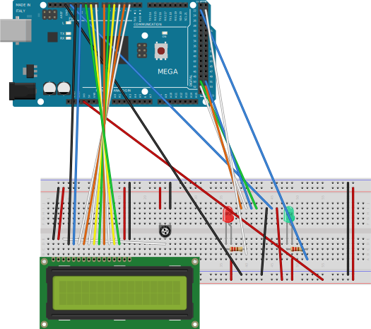

# RFID Reader


## LCD Programming

Chip used is a 5x11 dot matrix 1602 display where each position is a single character. This chip can display 2 lines of 16 characters.


| Instruction        | RS | R/W | B7 | B6 | B5 | B4 | B3 | B2 | B1 | B0 | Execution Time |
|--------------------|----|-----|----|----|----|----|----|----|----|----|----------------|
| Clear display      | 0  | 0   | 0  | 0  | 0  | 0  | 0  | 0  | 0  | 1  | 1.52 ms |
| Cursor home        | 0  | 0   | 0  | 0  | 0  | 0  | 0  | 0  | 1  | *  | 1.52 ms | 
| Entry mode set     | 0  | 0   | 0  | 0  | 0  | 0  | 0  | 1  | I/D| S  | 37 μs   | 
| Display control    | 0  | 0   | 0  | 0  | 0  | 0  | 1  | D  | C  | B  | 37 μs   |
| Display shift      | 0  | 0   | 0  | 0  | 0  | 1  | S/C| R/L| *  | *  | 37 μs   |
| Function set       | 0  | 0   | 0  | 0  | 1  | DL | N  | F  | *  | *  | 37 μs   |
| Set CGRAM address  | 0  | 0   | 0  | 1  |ADDR|    |    |    |    |    | 37 μs   |
| Set DDRAM address  | 0  | 0   | 1  |ADDR|    |    |    |    |    |    | 37 μs   |
| Read busy flag     | 0  | 1   | BF |ADDR|    |    |    |    |    |    | 0 μs    |
| Write RAM          | 1  | 0   |DATA|    |    |    |    |    |    |    | 37 μs   |
| Read from CG/DDRAM | 1  | 1   |DATA|    |    |    |    |    |    |    | 37 μs   |

---
### Instruction description

Clear display:      Clears Display and returns cursor to the home position (address 0).

Cursor home:        Returns cursor to home position. Also returns display being shifted to the original position. DDRAM content remains unchanged. 	

Entry mode set:     Sets cursor move direction (I/D); specifies to shift the display (S). These operations are performed during data read/write. 	

Display control:    Sets on/off of all display (D), cursor on/off (C), and blink of cursor position character (B). 	

display shift: 	    Sets cursor-move or display-shift (S/C), shift direction (R/L). DDRAM content remains unchanged. 	

Function set: 	    Sets interface data length (DL), number of display line (N), and character font (F). 	

Set CGRAM address:  Sets the CGRAM address. CGRAM data are sent and received after this setting. 	

Set DDRAM address:  Sets the DDRAM address. DDRAM data are sent and received after this setting. 	

Read busy flag:  	  Reads busy flag (BF) indicating internal operation being performed and reads CGRAM or DDRAM address counter contents (depending on previous instruction). 	

Write RAM: 	        Write data to CGRAM or DDRAM. 	

Read from CG/DDRAM: Read data from CGRAM or DDRAM. 	


### Instruction bit definition

| Instruction bit | 0                         | 1                               |
|-----------------|---------------------------|---------------------------------|
| I/D             | decrement cursor position | increment cursor position       |
| S               | no display shift          | display shift                   |
| D               | display off               | display on                      |
| C               | cursor off                | cursor on                       |
| B               | cursor blink off          | cursor blink on                 |
| S/C             | move cursor               | shift display                   |
| R/L             | shift left                | shift right                     |
| DL              | 4-bit interface           | 8-bit interface                 |
| N               | 1 line                    | 2 lines                         |
| F               | 5×8 dots                  | 5×10 dots                       |
| BF              | can accept instruction    | internal operation in progress  |

---

### Example commands:

| Command | Value |
|---------|-------|
| Function Set: 8-bit, 1 Line, 5x7 Dots | 0x30 | 
| Function Set: 8-bit, 2 Line, 5x7 Dots | 0x38 | 
| Function Set: 4-bit, 1 Line, 5x7 Dots | 0x20 | 
| Function Set: 4-bit, 2 Line, 5x7 Dots | 0x28 | 
| Entry Mode                            | 0x06 |
| Display off Cursor off                | 0x08 |
| Display on Cursor on                  | 0x0E |
| Display on Cursor off                 | 0x0C |
| Display on Cursor blinking            | 0x0F |
| Shift entire display left             | 0x18 |
| Shift entire display right            | 0x1C |
| Move cursor left by one character     | 0x10 |
| Move cursor right by one character    | 0x14 |
| Clear Display (clear DDRAM content)   | 0x01 |
| Set DDRAM address or cursor position on display   | 0x80 + address |
| Set CGRAM address or set pointer to CGRAM location | 0x40 + address |

---

* DDRAM address
```
00 01 02 03 04 05 06 07 ..... 32 33 34 35 36 37 38 39   - Character position (DEC)
-----------------------------------------------------
00 01 02 03 04 05 06 07 ..... 20 21 22 23 24 25 26 27   - Row 0 DDRAM address (HEX)
40 41 42 43 44 45 46 47 ..... 60 61 62 63 64 65 66 67   - Row 1 DDRAM address (HEX)
```

https://www.8051projects.net/lcd-interfacing/initialization.php


## RFID Chip

The MFRC522 chip is a read-write chip for contact communications at 13.56MHZ which also supports ISO 14443A / MIFRARE mode.


### SAK coding

| Bit number                                        | UID size | Memory    | Sec. Level | Hex Value | 8 | 7 | 6 | 5 | 4 | 3 | 2 | 1 |
|---------------------------------------------------|----------|-----------|------------|-----------|---|---|---|---|---|---|---|---|
| MIFARE Ultralight C CL2                           | double   |           |            | 00        | 0 | 0 | 0 | 0 | 0 | 0 | 0 | 0 |
| MIFARE Classic 1K                                 | single   | 1K        |            | 08        | 0 | 0 | 0 | 0 | 1 | 0 | 0 | 0 |
| MIFARE Classic 4K                                 | single   | 4K        |            | 18        | 0 | 0 | 0 | 1 | 1 | 0 | 0 | 0 |
| MIFARE Classic 1K CL2                             | double   | 1K        |            | 08        | 0 | 0 | 0 | 0 | 1 | 0 | 0 | 0 |
| MIFARE Classic 4K CL2                             | double   | 4K        |            | 18        | 0 | 0 | 0 | 1 | 1 | 0 | 0 | 0 |
| MIFARE Plus                                       | single   | 2K,SE(1K) | 1          | 08        | 0 | 0 | 0 | 0 | 1 | 0 | 0 | 0 |
| MIFARE Plus                                       | single   | 4K        | 1          | 18        | 0 | 0 | 0 | 1 | 1 | 0 | 0 | 0 |
| MIFARE Plus CL2                                   | double   | 2K,SE(1K) | 1          | 08        | 0 | 0 | 0 | 0 | 1 | 0 | 0 | 0 |
| MIFARE Plus CL2                                   | double   | 4K        | 1          | 18        | 0 | 0 | 0 | 1 | 1 | 0 | 0 | 0 |
| MIFARE Plus                                       | single   | 2K        | 2          | 10        | 0 | 0 | 0 | 1 | 0 | 0 | 0 | 0 |
| MIFARE Plus                                       | single   | 4K        | 2          | 11        | 0 | 0 | 0 | 1 | 0 | 0 | 0 | 1 |
| MIFARE Plus CL2                                   | double   | 2K        | 2          | 10        | 0 | 0 | 0 | 1 | 0 | 0 | 0 | 0 |
| MIFARE Plus CL2                                   | double   | 4K        | 2          | 11        | 0 | 0 | 0 | 1 | 0 | 0 | 0 | 1 |
| MIFARE Plus                                       | single   | 2K,SE(1K) | 3          | 20        | 0 | 0 | 1 | 0 | 0 | 0 | 0 | 0 |
| MIFARE Plus                                       | single   | 4K        | 3          | 20        | 0 | 0 | 1 | 0 | 0 | 0 | 0 | 0 |
| MIFARE Plus CL2                                   | double   | 2K,SE(1K) | 3          | 20        | 0 | 0 | 1 | 0 | 0 | 0 | 0 | 0 |
| MIFARE Plus CL2                                   | double   | 4K        | 3          | 20        | 0 | 0 | 1 | 0 | 0 | 0 | 0 | 0 |

---

### Memory layout (1k variant)

<style type="text/css">
.tg  {border-collapse:collapse;border-spacing:0;}
.tg td{border-color:black;border-style:solid;border-width:1px;font-family:Arial, sans-serif;font-size:14px;
  overflow:hidden;padding:10px 5px;word-break:normal;}
.tg th{border-color:black;border-style:solid;border-width:1px;font-family:Arial, sans-serif;font-size:14px;
  font-weight:normal;overflow:hidden;padding:10px 5px;word-break:normal;}
.tg .tg-baqh{text-align:center;vertical-align:top}
.tg .tg-c3ow{border-color:inherit;text-align:center;vertical-align:top}
.tg .tg-0pky{border-color:inherit;text-align:left;vertical-align:top}
.tg .tg-0lax{text-align:left;vertical-align:top}
</style>
<table class="tg">
<thead>
  <tr>
    <th class="tg-0pky" colspan="2"></th>
    <th class="tg-c3ow" colspan="16">Byte number within block</th>
    <th class="tg-0pky"></th>
  </tr>
</thead>
<tbody>
  <tr>
    <td class="tg-0pky">Sector</td>
    <td class="tg-0pky">Block</td>
    <td class="tg-0pky">0</td>
    <td class="tg-0pky">1</td>
    <td class="tg-0pky">2</td>
    <td class="tg-0pky">3</td>
    <td class="tg-0pky">4</td>
    <td class="tg-0pky">5</td>
    <td class="tg-0pky">6</td>
    <td class="tg-0pky">7</td>
    <td class="tg-0pky">8</td>
    <td class="tg-0pky">9</td>
    <td class="tg-0pky">10</td>
    <td class="tg-0pky">11</td>
    <td class="tg-0pky">12</td>
    <td class="tg-0pky">13</td>
    <td class="tg-0pky">14</td>
    <td class="tg-0pky">15</td>
    <td class="tg-0pky">Description</td>
  </tr>
  <tr>
    <td class="tg-0pky">15</td>
    <td class="tg-0pky">3</td>
    <td class="tg-c3ow" colspan="6" style="text-align:center">Key A</td>
    <td class="tg-c3ow" colspan="4">Access Bits</td>
    <td class="tg-c3ow" colspan="6">Key B</td>
    <td class="tg-0pky">Trailer 15</td>
  </tr>
  <tr>
    <td class="tg-0pky"></td>
    <td class="tg-0pky">2</td>
    <td class="tg-0pky"></td>
    <td class="tg-0pky"></td>
    <td class="tg-0pky"></td>
    <td class="tg-0pky"></td>
    <td class="tg-0pky"></td>
    <td class="tg-0pky"></td>
    <td class="tg-0pky"></td>
    <td class="tg-0pky"></td>
    <td class="tg-0pky"></td>
    <td class="tg-0pky"></td>
    <td class="tg-0pky"></td>
    <td class="tg-0pky"></td>
    <td class="tg-0pky"></td>
    <td class="tg-0pky"></td>
    <td class="tg-0pky"></td>
    <td class="tg-0pky"></td>
    <td class="tg-0pky">Data</td>
  </tr>
  <tr>
    <td class="tg-0pky"></td>
    <td class="tg-0pky">1</td>
    <td class="tg-0pky"></td>
    <td class="tg-0pky"></td>
    <td class="tg-0pky"></td>
    <td class="tg-0pky"></td>
    <td class="tg-0pky"></td>
    <td class="tg-0pky"></td>
    <td class="tg-0pky"></td>
    <td class="tg-0pky"></td>
    <td class="tg-0pky"></td>
    <td class="tg-0pky"></td>
    <td class="tg-0pky"></td>
    <td class="tg-0pky"></td>
    <td class="tg-0pky"></td>
    <td class="tg-0pky"></td>
    <td class="tg-0pky"></td>
    <td class="tg-0pky"></td>
    <td class="tg-0pky">Data</td>
  </tr>
  <tr>
    <td class="tg-0pky"></td>
    <td class="tg-0pky">0</td>
    <td class="tg-0pky"></td>
    <td class="tg-0pky"></td>
    <td class="tg-0pky"></td>
    <td class="tg-0pky"></td>
    <td class="tg-0pky"></td>
    <td class="tg-0pky"></td>
    <td class="tg-0pky"></td>
    <td class="tg-0pky"></td>
    <td class="tg-0pky"></td>
    <td class="tg-0pky"></td>
    <td class="tg-0pky"></td>
    <td class="tg-0pky"></td>
    <td class="tg-0pky"></td>
    <td class="tg-0pky"></td>
    <td class="tg-0pky"></td>
    <td class="tg-0pky"></td>
    <td class="tg-0pky">Data</td>
  </tr>
  <tr>
    <td class="tg-baqh">:</td>
    <td class="tg-baqh">:</td>
    <td class="tg-baqh" colspan="6">Key A</td>
    <td class="tg-baqh" colspan="4">Access Bits</td>
    <td class="tg-baqh" colspan="6">Key B</td>
    <td class="tg-0lax"></td>
  </tr>
  <tr>
    <td class="tg-baqh">:</td>
    <td class="tg-baqh">:</td>
    <td class="tg-0lax"></td>
    <td class="tg-0lax"></td>
    <td class="tg-0lax"></td>
    <td class="tg-0lax"></td>
    <td class="tg-0lax"></td>
    <td class="tg-0lax"></td>
    <td class="tg-0lax"></td>
    <td class="tg-0lax"></td>
    <td class="tg-0lax"></td>
    <td class="tg-0lax"></td>
    <td class="tg-0lax"></td>
    <td class="tg-0lax"></td>
    <td class="tg-0lax"></td>
    <td class="tg-0lax"></td>
    <td class="tg-0lax"></td>
    <td class="tg-0lax"></td>
    <td class="tg-0lax"></td>
  </tr>
  <tr>
    <td class="tg-baqh">:</td>
    <td class="tg-baqh">:</td>
    <td class="tg-0lax"></td>
    <td class="tg-0lax"></td>
    <td class="tg-0lax"></td>
    <td class="tg-0lax"></td>
    <td class="tg-0lax"></td>
    <td class="tg-0lax"></td>
    <td class="tg-0lax"></td>
    <td class="tg-0lax"></td>
    <td class="tg-0lax"></td>
    <td class="tg-0lax"></td>
    <td class="tg-0lax"></td>
    <td class="tg-0lax"></td>
    <td class="tg-0lax"></td>
    <td class="tg-0lax"></td>
    <td class="tg-0lax"></td>
    <td class="tg-0lax"></td>
    <td class="tg-0lax"></td>
  </tr>
  <tr>
    <td class="tg-baqh">:</td>
    <td class="tg-baqh">:</td>
    <td class="tg-0lax"></td>
    <td class="tg-0lax"></td>
    <td class="tg-0lax"></td>
    <td class="tg-0lax"></td>
    <td class="tg-0lax"></td>
    <td class="tg-0lax"></td>
    <td class="tg-0lax"></td>
    <td class="tg-0lax"></td>
    <td class="tg-0lax"></td>
    <td class="tg-0lax"></td>
    <td class="tg-0lax"></td>
    <td class="tg-0lax"></td>
    <td class="tg-0lax"></td>
    <td class="tg-0lax"></td>
    <td class="tg-0lax"></td>
    <td class="tg-0lax"></td>
    <td class="tg-0lax"></td>
  </tr>
  <tr>
    <td class="tg-0lax">0</td>
    <td class="tg-0lax">3</td>
    <td class="tg-baqh" colspan="6">Key A</td>
    <td class="tg-baqh" colspan="4">Access Bits</td>
    <td class="tg-baqh" colspan="6">Key B</td>
    <td class="tg-0lax">Trailer 0</td>
  </tr>
  <tr>
    <td class="tg-0lax"></td>
    <td class="tg-0lax">2</td>
    <td class="tg-0lax"></td>
    <td class="tg-0lax"></td>
    <td class="tg-0lax"></td>
    <td class="tg-0lax"></td>
    <td class="tg-0lax"></td>
    <td class="tg-0lax"></td>
    <td class="tg-0lax"></td>
    <td class="tg-0lax"></td>
    <td class="tg-0lax"></td>
    <td class="tg-0lax"></td>
    <td class="tg-0lax"></td>
    <td class="tg-0lax"></td>
    <td class="tg-0lax"></td>
    <td class="tg-0lax"></td>
    <td class="tg-0lax"></td>
    <td class="tg-0lax"></td>
    <td class="tg-0lax">Data</td>
  </tr>
  <tr>
    <td class="tg-0lax"></td>
    <td class="tg-0lax">1</td>
    <td class="tg-0lax"></td>
    <td class="tg-0lax"></td>
    <td class="tg-0lax"></td>
    <td class="tg-0lax"></td>
    <td class="tg-0lax"></td>
    <td class="tg-0lax"></td>
    <td class="tg-0lax"></td>
    <td class="tg-0lax"></td>
    <td class="tg-0lax"></td>
    <td class="tg-0lax"></td>
    <td class="tg-0lax"></td>
    <td class="tg-0lax"></td>
    <td class="tg-0lax"></td>
    <td class="tg-0lax"></td>
    <td class="tg-0lax"></td>
    <td class="tg-0lax"></td>
    <td class="tg-0lax">Data</td>
  </tr>
  <tr>
    <td class="tg-0lax"></td>
    <td class="tg-0lax">0</td>
    <td class="tg-baqh" colspan="16">Manufacturer Data</td>
    <td class="tg-0lax">Manufacturer Block</td>
  </tr>
</tbody>
</table>


<br><br><br>


